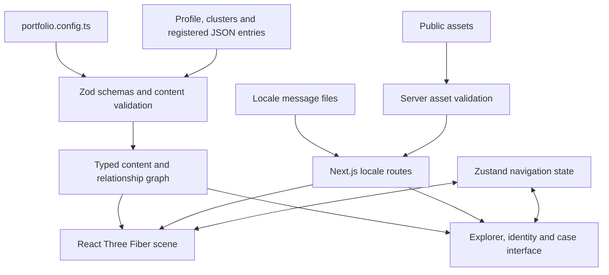

# Architecture

[English](./architecture.md) | [Português](../pt-BR/architecture.md) · [Back to home](../../README.md)

This guide is for contributors who want to change the engine. For personal content, start with [Build your portfolio](build-your-portfolio.md); most customization does not require component changes.

## System overview

Vector Space is a Next.js application with locale routes, an HTML interface and a client-side Three.js scene. Content lives in versioned JSON files committed with the application. There is no CMS dashboard, database or content API to configure.

The content boundary validates data before it reaches rendering. The scene and HTML interface consume the same entities, signals and graph targets, so connections do not need a second rendering-specific content model.

## Repository map

| Location | Responsibility |
|---|---|
| [`src/app/`](../../src/app/) | App Router pages, layouts, global styles and metadata |
| [`src/i18n/`](../../src/i18n/) | Locale routing, request integration and server-side message loading |
| [`src/content/`](../../src/content/) | JSON documents, interface messages, registry and typed adapters |
| [`src/lib/`](../../src/lib/) | Schemas, graph, layout, navigation rules, asset validation and pure helpers |
| [`src/store/experience-store.ts`](../../src/store/experience-store.ts) | Shared navigation state and transitions |
| [`src/components/portfolio/`](../../src/components/portfolio/) | Entry screens, HUD, identity actions, HTML explorer and case components |
| [`src/components/three/`](../../src/components/three/) | Canvas, camera, clusters, nodes, satellites and cover reconstruction |
| [`public/assets/`](../../public/assets/) | Public media served directly by the app |
| [`portfolio.config.ts`](../../portfolio.config.ts) | Locale and branding configuration |

## Content loading and validation

1. [registry.ts](../../src/content/registry.ts) imports each entry and associates its data with a source filename.
2. The [schema](../../src/lib/portfolio-schema.ts) validates strict shapes, version, localized fields and safe destinations. Collection checks reject duplicate IDs/slugs, unknown clusters and invalid relations.
3. Adapters in `src/content/identity.ts`, `clusters.ts` and `nodes/index.ts` export typed content.
4. [portfolio-graph.ts](../../src/lib/portfolio-graph.ts) resolves shared targets for identity, clusters and nodes, including signal references.
5. [content-assets.server.ts](../../src/lib/content-assets.server.ts) validates referenced local `/assets/` files during page generation and development requests. Filesystem checks stay outside the client bundle.

The explicit registry makes inclusion reviewable and keeps the client independent of filesystem discovery. The tradeoff is that authors must add an import and registry entry for each new file. The `file` string supplies useful error context; it does not load a document by itself.

## Navigation and rendering

[experience-store.ts](../../src/store/experience-store.ts) coordinates `intro`, `language-selection`, `entering`, `overview`, `identity-focus`, `cluster-focus`, `node-focus` and `node-details`. Locale changes preserve a resume stage. Cases open in a dialog; individual slugs do not currently create independent case routes.

[UniverseCanvas](../../src/components/three/UniverseCanvas.tsx) hosts the scene. [CameraRig](../../src/components/three/CameraRig.tsx) handles camera transitions, with pure navigation and interaction helpers under `src/lib/`. Cluster and node meshes render validated content; automatic positioning is deterministic for a given content order and configuration. Manual coordinates remain an optional escape hatch for authored layouts.

The desktop scene supports orbit, pan and cursor-oriented zoom. Mobile uses guided navigation. Escape steps back through detail, node and cluster states; `H` centers the overview. The HTML career explorer supplies explicit controls for reaching the same content. A fallback interface remains available when WebGL cannot initialize.

Performance settings adapt to device capabilities, viewport and motion preferences. They limit active project covers and signal satellites, and reduce effects. [useProjectCoverTexture](../../src/components/three/useProjectCoverTexture.ts) manages cover loading, procedural fallbacks and a bounded texture cache. A valid content file can contain more signals than a particular device displays in orbit.

When changing camera or selection logic, preserve the invariants tested in the navigation, world-interaction, automatic-focus and store suites. Verify keyboard behavior and a narrow viewport in a real browser; a successful build cannot prove spatial interaction works.

## Case composition

[NodeDetailsPanel](../../src/components/portfolio/NodeDetailsPanel.tsx) provides the dialog, focus restoration and cover/header. [CaseEvidence](../../src/components/portfolio/CaseEvidence.tsx) renders metadata, signals, graph connections and optional evidence. [CaseContentRenderer](../../src/components/portfolio/CaseContentRenderer.tsx) maps the five editorial block types to the existing case layout.

Authors control narrative order through `content`, while layout stays in components and CSS. Small presentation enums allow image alignment and width choices without accepting arbitrary styles or markup. Legacy evidence fields remain supported, which eases migration but makes duplicate sections possible if authors fill both models with the same copy. See the [display order](content-reference.md#case-display-order).

## Localization and production output

Content translations and interface messages serve different purposes. [loadMessages](../../src/i18n/messages.ts) reads the configured default catalog, then merges optional translations. Localized content uses the default-language fallback helper. Resume destinations intentionally have no cross-language fallback.

[next.config.ts](../../next.config.ts) explicitly includes `src/content/messages/*.json` in output-file tracing because messages are read dynamically through the filesystem. Preserve that inclusion when changing packaging or message paths; see [Next.js output tracing](https://nextjs.org/docs/app/api-reference/config/next-config-js/output). The current project uses the normal Next.js production build/start flow, not static export.

## Working on the engine

Run `npm test`, `npm run typecheck` and `npm run build` for relevant engine changes. Tests compile TypeScript into `.test-dist` and execute the emitted test suites. The test script expects a POSIX-compatible shell. There is no project lint command or bundled browser-test runner.

Some content tests deliberately assert the generic starter fixtures. If changing the template examples, update their expectations together with the content. If maintaining a personalized fork, distinguish fixture changes from behavior regressions as explained in the [tutorial](build-your-portfolio.md#about-the-template-tests).

For a new content field or block, update the schema, types, consumer, meaningful validation/behavior tests and both reference translations together. Do not add a second hardcoded source of identity or career text inside components.

Earlier implementation notes remain in [the content refactor record](../content-cms-refactor.md), [plans](../plans/) and [ideas](../ideas/). They provide historical context; the current code and these guides describe the supported contract.

---

[Previous: Content reference](content-reference.md) · [Next: Troubleshooting](troubleshooting.md)
