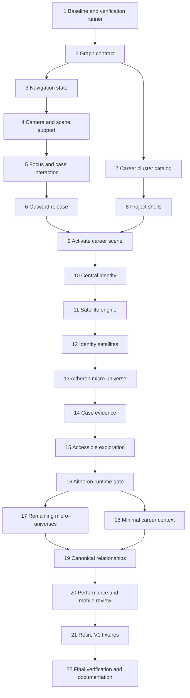

# Implementation Plan: V2 Career Knowledge Graph

Status: original V2 implementation and verification complete. Changes remain uncommitted as requested. Provisional content and software-renderer limitations are documented below.

Source: the supplied “Marlon // Vector Space — V2: Career Knowledge Graph” brief. Repository inspected at `8192331` (`fix: prioritize project preview clicks`), with a clean working tree before this document was added.

> Follow-up requested on 2026-09-10: image and title/summary clicks now open cases directly. The original focus-first requirement below is historical; the revised behavior and layout are recorded at the end.

## Outcome and scope

Evolve the approved V1 into Marlon's career knowledge graph. The first meaningful scene contains Marlon and exactly four career clusters. The first complete feature is **Marlon → Key Projects → Aitheron → micro-universe → case details → Key Projects → overview**. Expansion of the other projects' micro-universes and the other clusters' content waits until this journey passes its runtime checkpoint.

Preserve the landing layout, visual identity, particles, language gateway, camera feel, zoom-to-cursor, elastic boundaries, mobile navigation, and fragmented cover reconstruction. Keep the application deterministic and static. No LLM APIs, embeddings, vector database, RAG implementation, semantic search, ECHO, Lab, or other V3 functionality.

The V1 audit below records the starting point. The ordered tasks preserve the approved implementation plan; the execution and verification record at the end documents the completed work and measured limitations.

## V1 audit and reuse map

| Responsibility | Existing implementation and finding | V2 evolution |
| --- | --- | --- |
| Content types | `src/lib/portfolio-types.ts`: `PortfolioNode`, five technical cluster IDs, visual variants, localized text | Extend the existing node contract; keep one primary anchor and add optional career metadata. |
| Validation | `src/lib/portfolio-schema.ts`: strict Zod objects, unique IDs/slugs, string relationships validated against node IDs | Add typed relations, optional satellites, and graph-wide target validation. Preserve actionable build errors. |
| Registry | `src/content/nodes/index.ts`: five explicitly registered fixtures and one position map | Keep the single registry; replace fixtures with canonical career entries. |
| Spatial layout | `src/content/clusters.ts`: cluster catalog, `clusterById`, ID-seeded placement | Reuse placement; configure four career regions and bounded importance adjustments. |
| Scene | `src/components/three/UniverseCanvas.tsx`: background, clusters, nodes, preview budget, gateway | Add one central identity and extend relevance management. Preserve scene infrastructure. |
| Identity | The name exists in intro/HUD HTML; no central identity renderer or local avatar/image asset was found | Build a small identity anchor from the existing visual primitives; no image generation dependency. |
| Cluster rendering | `SemanticCluster.tsx`: pattern-driven geometry and HTML labels | Reuse patterns and colors, adjusting relative emphasis and focus dimming. |
| Entity rendering | `PortfolioNodeMesh.tsx`: generic variants, distance reveal, preview and click surfaces | Keep generic rendering; consume importance and satellite data. |
| Navigation state | `src/store/experience-store.ts`: selecting a node immediately enters `node-details` | Add `node-focus`; separate spatial selection from opening the HTML case. |
| Camera | `CameraRig.tsx`: damped destinations, OrbitControls, zoom-to-cursor, touch gestures, elastic boundaries | Extend destination/stage handling. Controls currently permit exploration only in overview/cluster focus. |
| Returning outward | Store handles Escape/back; camera has no distance-driven semantic release | Preserve existing back behavior and add a tested release policy for the new project focus. |
| Progressive reveal | `performance-quality.ts`: signal/identity/preview, selected override, hysteresis | Reuse distance/ref patterns; add bounded satellite relevance. |
| Cover reconstruction | `FragmentedProjectCover.tsx`, `createFragmentedCoverGeometry.ts`, `useProjectCoverTexture.ts` | Keep the shaders, geometry, UV handling, failure fallback and texture cache. |
| Preview budget | `PreviewBudgetTracker` and `imageFormationConfig` | Preserve high/medium/low limits of 3/2/1 active covers; budget satellites separately. |
| Click behavior | `world-interaction.ts` and preview hit plane | Preserve full-frame click priority and drag tolerance when changing activation semantics. |
| HTML detail | `NodeDetailsPanel.tsx`: native dialog, cover, summary, description, taxonomy, links, focus restoration | Extend conditional case sections; close to project focus rather than clearing selection. |
| Accessibility | `VectorSpaceFallback.tsx` is currently mounted only when WebGL is unavailable | Make essential content reachable through semantic HTML during normal WebGL use too. |
| Localization | `next-intl`, `src/messages/{pt,en}.json`, localized content objects | One graph with two languages; retain the selected context through locale transitions. |
| Mobile and motion | HUD cluster cycling, OrbitControls touch mapping, quality detection, motion preference | Keep Vector Space; reduce local label count/radius and stop satellite orbit with reduced motion. |
| Verification | `npm test` compiles/runs boundary and interaction suites; `npm run typecheck`; `npm run build` | Extend the existing test mechanism for graph, navigation state and satellite policy. No new test framework planned. |

Additional constraints from the audit:

- `node.cluster` is consumed by placement, camera-related selection, covers, fallback, and details. Renaming it everywhere adds churn without changing its meaning.
- `relationships` currently accepts node IDs only. Cluster references cannot simply be dropped into that field.
- Desktop details offset the camera target by `3.25`. Apply that composition only to the case view, keeping project focus centered on the entity.
- The native dialog and global Escape listener can both participate in closing. Assign one owner per transition to prevent a single Escape from skipping levels.
- Locale changes reconstruct the stage from selected IDs. That currently implies `node-details` whenever a node is selected; preserve whether V2 was exploring or reading the case.
- Locale switching writes `cluster`/`node` query parameters, but the page does not hydrate state from them. Preserve session context; new deep-link support is outside this iteration.
- V1 images are external placeholders plus procedural covers. There is no `public` asset directory to reuse. Preserve procedural recovery when external images fail.
- `QueryProbe.tsx` is a decorative entry animation. Preserve it; its name is not authorization to add retrieval behavior.

## Architecture decisions

### Canonical data and relationships

Keep `PortfolioNode`, its existing names (`kind`, `title`, `summary`, `image`, `links`), and the single node registry. **`cluster` remains the primary spatial anchor**, equivalent to the brief's `primaryCluster`; do not store both fields.

Extend the contract with optional `importance`, `relations`, `satellites`, case fields, confidentiality, image category, and event participation role. Keep the relation vocabulary small: `built-at`, `uses`, `related-to`, `produced`, `thesis-of`, `impact`, `presented-at`, `research`. Provide defaults for missing satellite/relation arrays and allow empty technologies/tags for incomplete experience, education and event entries. Essential ID, localized title/summary, kind and placement remain validated.

Use a derived graph lookup over the identity record, cluster definitions, and registered portfolio nodes. This is an index of existing data, not a second content registry. Keep `portfolio-graph.ts` pure: callers supply these records, avoiding a circular import between schema, registry and graph lookup. Include the identity record when Task 10 introduces it. Validate globally unique target IDs, node slugs, primary anchors, relation targets, satellite IDs within their owner, and any `relationTargetId`. Satellites are contextual display metadata; an unlinked “PyTorch” label does not require a new navigable technology node. Never accept a dangling target merely because it resembles a technology name.

During migration, normalize legacy `relationships` to `related-to` once at validation, with explicit handling of mixed old/new fields. Remove that compatibility path after the five old fixtures are retired. Keep old cluster IDs/configuration available only during the staged cutover so each task remains buildable; the final catalog and type contain exactly four primary clusters.

Optional case data supports year, status, project type, problem, solution, role, impact, company, gallery and existing link types plus documents. Extend the existing image object with a category for project image, conceptual visual, or event photo. Hide absent sections, empty lists and absent links. Do not manufacture values to fill a template.

### Navigation contract

| Action | Result |
| --- | --- |
| Enter the universe | Overview centered on Marlon and four clusters. |
| Select a cluster | `cluster-focus`; preserve the current smooth transition. |
| Activate an entity signal, label or preview | `node-focus`; select one canonical node and its primary cluster; travel without opening a dialog. |
| Explore the focused entity | Orbit/pan/zoom remain enabled after arrival; reveal satellites and the existing cover. |
| Activate “Open case” in the existing HTML interface after camera arrival | `node-details`; retain the selected entity and apply current detail composition. |
| Close case / Escape in dialog | Return to `node-focus`, restoring focus to the case opener. |
| Escape from project focus | Return to the primary cluster. |
| Zoom outward from project focus | Release to the primary cluster once a distance threshold is crossed. |
| Continue zooming outward / Escape from cluster focus | Return to overview; one semantic transition at a time. |
| Overview button / `H` | Clear selection and recenter on Marlon. |
| Change locale | Restore the previous semantic stage and selected canonical IDs after the gateway animation. |

Marlon is the overview's semantic center; it does not require another camera-navigation level or an About modal. The new `node-focus` name also covers future experience/education/event entries. Camera arrival may publish one semantic readiness update to enable case access; selecting a different target clears readiness. WebGL fallback marks an HTML-selected entity ready immediately, and context loss clears any dependency on a camera-arrival event.

Choose outward-release distances after measuring the V1 baseline. Keep thresholds within reachable control distances, add hysteresis, and evaluate only during user exploration—not during camera arrival or while a dialog is open. A distant pan alone must not trigger release. Store changes happen only when crossing a semantic boundary; visual values remain in refs.

### Scene hierarchy and satellites

Use existing colors, patterns and deterministic placement. Marlon has the strongest initial anchor. Key Projects and Experience & Impact receive slightly more emphasis; Aitheron is flagship, the other three Tier 1 projects are primary, and DocGuard is secondary. Keep real depth and space for the existing cover's full rectangular hit area.

One `MicroUniverse` renderer serves identity and project satellites through data/configuration. Stable ID-seeded placement, slow orbit, depth/parallax and angle-dependent opacity use refs/Three.js updates. Satellite visuals must not capture pointer input or become buttons.

Initial budgets are 4–6 visible identity signals on desktop; up to 6 for Aitheron and a hard maximum of 7 per project; 3–5 on tablets and 2–4 on phones. Use the smaller limit imposed by viewport and quality. Initially allow one detailed project micro-universe at a time, prioritizing the selected project or nearest relevant candidate; keep other entities as spatial signals. Distant systems do not mount text or run per-satellite animation. Reduced motion uses stable placement. Global caps prevent many individually small systems becoming an expensive whole.

Keep image reconstruction distances and effects intact initially. Satellites begin emerging during approach and become legible before the image completes; tune their thresholds around the existing cover progression. Relevance changes dim unrelated content while retaining spatial continuity.

### Content boundaries

The five project names are real; descriptions and assets remain explicitly provisional. Use only supplied concepts. Any supplied metric used in prototype content must be identified as provisional context in HTML, not represented as an independently verified achievement.

| Entry | Importance / primary cluster | Initial satellite vocabulary |
| --- | --- | --- |
| Aitheron | Flagship / Key Projects | BRCA1 / BRCA2, PyTorch, Genomic AI, Research, AUROC 0.99+, FastAPI |
| Multi-Agent Tariff Intelligence | Primary / Key Projects | Agents, Enterprise AI, Automation, Validation, LLMs, +70% |
| PN Extractor | Primary / Key Projects | Document AI, Extraction, Validation, 6h → ~15min, ~98%, Automation |
| Enterprise LLM Infrastructure | Primary / Key Projects | LiteLLM, Routing, Multi-provider, Reliability, Observability, Production AI |
| DocGuard | Secondary / Key Projects | PII, Sanitization, Privacy, Safe AI, NER, Security |

Do not infer real companies, dates, clients, deployment scale, technical implementations, awards or URLs from the old fixtures. Professional imagery remains conceptual and clearly described. No project metrics orbit Marlon.

After the Aitheron gate, add only one generic professional experience, one Software Engineering education entity, and two small community fixtures demonstrating speaker/workshop-host versus attendee. The model also supports mentor and panelist. Education relates to the canonical Aitheron; experience references the existing professional projects. No copies of projects in secondary clusters.

Do not introduce RareFind, an Ethereum project, Chemistry, a prominent English-proficiency node, skills/proficiency meters, extra primary clusters, or a employment-timeline feature. Relation lines are deferred; V2 exposes relationships through contextual HTML and optional satellite targets.

## Dependency map and milestones

Tasks are ordered for one implementer. The first six isolate the main behavioral risk using V1 content. Tasks 7–10 introduce the career narrative. Tasks 11–16 deliver and validate the first full vertical. Tasks 17–22 expand only after that proof.

Every task includes verification. At each checkpoint, run the full available tests, typecheck and production build, and record the stated browser evidence. Fix a failing checkpoint before continuing. Human visual feedback is useful at milestones; the Aitheron quality gate is mandatory before content expansion.

## Tasks

### Task 1: Establish the V1 verification baseline

**Description:** Record the existing experience before changing behavior and prepare the current test runner for the small new behavioral suites.

**Acceptance criteria:**
- Record V1 entry, cluster selection, project opening, close/Escape, overview, preview clicks and desktop/touch gestures in PT/EN.
- Record viewport/device, quality, frame-time distribution, draw calls, labels and texture counts for equivalent overview/approach/detail journeys, including reduced motion and WebGL failure.
- Extend the existing TypeScript + `node:test` setup to discover new emitted suites without adding a framework; avoid unresolved runtime aliases and stale compiled tests.

**Verification:** `npm test`, `npm run typecheck`, `npm run build`; `npm run dev` and real-browser checks. Report pre-existing failures separately.

**Dependencies:** None. **Files likely touched:** `package.json`, `tsconfig.navigation-test.json`, this plan's verification record. **Estimated scope:** M, 3 files.

### Task 2: Extend the canonical graph contract

**Description:** Add the V2 fields and graph validation while retaining working V1 data and renderer contracts.

**Acceptance criteria:**
- Existing fixtures still validate; incomplete career entries can omit optional case fields and use empty taxonomy; importance and all five participation roles are represented.
- Typed relations and satellites validate bilingual labels, limits, duplicate IDs/slugs, missing anchors and dangling references, with predictable legacy-relationship normalization.
- A derived lookup resolves identity/cluster/node targets without duplicating content; the primary anchor remains `cluster`; career IDs can coexist temporarily with legacy IDs.

**Verification:** Add fixture-based success/failure tests for the cases above; run `npm test`, `npm run typecheck`, `npm run build`.

**Dependencies:** 1. **Files likely touched:** `src/lib/portfolio-types.ts`, `src/lib/portfolio-schema.ts`, new `src/lib/portfolio-graph.ts`, new `src/lib/portfolio-schema.test.ts`. **Estimated scope:** M, 4 files.

### Checkpoint A — Baseline and contract, after Tasks 1–2

- Baseline evidence exists; unchanged V1 still runs.
- Tests, typecheck and build pass; invalid graph fixtures fail for the intended reason.

### Task 3: Define project-focus transitions

**Description:** Introduce a spatial focus stage independently of the details dialog without activating the new flow yet.

**Acceptance criteria:**
- Store actions distinguish focus, arrival readiness, open case, close case and leave entity; selection invariants hold at every level and a new target clears readiness.
- Locale entry/return preserves focus versus case stage, and overview reset clears context consistently.
- `node-focus` maps to the node camera profile; legacy activation remains functional until Task 5 switches callers.

**Verification:** Test actual store actions for the full transition chain, repeated close/back, locale restoration and overview reset; `npm test`, `npm run typecheck`.

**Dependencies:** 2. **Files likely touched:** `src/lib/portfolio-types.ts`, `src/store/experience-store.ts`, `src/lib/scene-config.ts`, new `src/store/experience-store.test.ts`. **Estimated scope:** M, 4 files.

### Task 4: Support spatial focus in the camera and scene

**Description:** Teach existing stage consumers to keep the universe visible and explorable while a project is focused.

**Acceptance criteria:**
- Camera targets the node in `node-focus`, applies the lateral composition only in details, and preserves OrbitControls, damping, boundaries and touch mapping.
- Scene, HUD and parent experience remain mounted in the new stage; arrival marks the focused entity ready once, controls resume, and modal behavior stays intact.
- PT/EN focus/open-case/back instructions and the planned case/relationship labels exist; stage restoration after a language transition works.

**Verification:** Exercise the new store action in the browser before changing click callers; compare camera feel against Task 1; `npm test`, `npm run typecheck`, `npm run build`.

**Dependencies:** 3. **Files likely touched:** `CameraRig.tsx`, `UniverseCanvas.tsx`, `VectorSpaceExperience.tsx`, `src/messages/en.json`, `src/messages/pt.json` (component paths are those in the audit). **Estimated scope:** M, 5 files.

### Task 5: Connect entity focus to explicit case access

**Description:** Change world activation to travel first and expose the case through the existing HTML interface.

**Acceptance criteria:**
- Node core, label and the complete preview rectangle focus the entity; selecting it never immediately opens the case. The explicit keyboard/touch-accessible HUD case action becomes usable after arrival.
- Opening/closing the native dialog preserves node focus and restores focus to its opener; one Escape performs one transition, including native cancel handling.
- Preview priority and drag tolerance survive the action split; fallback selection is immediately ready for case access, with no camera dependency, and decorative surfaces do not steal clicks.

**Verification:** Browser-test preview corners/center, drag versus click, keyboard activation, Escape and fallback. Run existing interaction tests and store tests with `npm test`; run `npm run typecheck`.

**Dependencies:** 4. **Files likely touched:** `PortfolioNodeMesh.tsx`, `PortfolioHUD.tsx`, `VectorSpaceFallback.tsx`, `NodeDetailsPanel.tsx`, `src/app/globals.css`. **Estimated scope:** M, 5 files.

### Checkpoint B — Spatial selection, after Tasks 3–5

- V1 fixtures can be visited before opening their details; cases close to the visited entity.
- Camera, full-preview click behavior and PT/EN state retention work; tests/typecheck/build pass.

### Task 6: Release focus through outward zoom

**Description:** Add the minimal camera-to-semantic-state boundary needed to leave micro-universes naturally.

**Acceptance criteria:**
- Reachable, measured thresholds release node → primary cluster → overview, one step at a time, with hysteresis.
- Arrival, lateral pan, modal state and threshold jitter do not trigger accidental releases or repeated store writes.
- Escape, `H`, overview controls and outward zoom lead to consistent destinations on desktop and touch.

**Verification:** Boundary-policy unit tests plus browser wheel/pinch tests from centered and panned views; `npm test`, `npm run typecheck`.

**Dependencies:** 5. **Files likely touched:** `src/lib/scene-navigation.ts`, `src/lib/scene-navigation.test.ts`, `src/lib/scene-config.ts`, `CameraRig.tsx`. **Estimated scope:** M, 4 files.

### Task 7: Define the four career regions

**Description:** Prepare the final career cluster catalog without prematurely switching the active V1 registry.

**Acceptance criteria:**
- Define `key-projects`, `experience-impact`, `education-research`, `talks-community` with the exact supplied PT/EN labels.
- Reuse the existing palette/patterns and placement function, reserving the overview center for identity and spacing clusters within the existing navigation envelope.
- Keep legacy cluster definitions available only for the still-active fixtures; no duplicate renderer, new navigation system or fifth V2 region.

**Verification:** `npm run typecheck`, `npm run build`; inspect candidate positions against the baseline camera/boundaries. Final visual fit is checked at Task 9.

**Dependencies:** 2. **Files likely touched:** `src/content/clusters.ts`. **Estimated scope:** S, 1 file.

### Task 8: Prepare the five canonical project shells

**Description:** Create one data file per real project, ready for a single registry cutover. Do not populate the four non-Aitheron micro-universes yet.

**Acceptance criteria:**
- The five exact project names, unique IDs/slugs, primary anchors and importance tiers are represented; Aitheron and Enterprise LLM Infrastructure have their intended prominence.
- Copy is short, bilingual and provisional; no inherited unverified claims, fabricated links/companies or confidential screenshots.
- Existing visual variants and procedural/existing placeholder imagery suffice; satellite arrays stay empty until their implementation task.

**Verification:** Typecheck the data; validate these objects with the Task 2 schema before registration. No visual-regression tests for static text.

**Dependencies:** 7. **Files likely touched:** new files under `src/content/nodes/key-projects/`: `aitheron.ts`, `multi-agent-tariff-intelligence.ts`, `pn-extractor.ts`, `enterprise-llm-infrastructure.ts`, `docguard.ts`. **Estimated scope:** M, 5 small data files.

### Checkpoint C — Navigation and migration readiness, after Tasks 6–8

- Outward zoom and Escape cannot trap a visitor.
- V1 remains operational; new data validates before activation; tests/typecheck/build pass.

### Task 9: Activate the career scene

**Description:** Switch the active catalog and the single registry together so all consumers see the same four-region graph.

**Acceptance criteria:**
- Scene, HUD, fallback, details and position lookup use exactly four active career clusters and five canonical project entries.
- Existing automatic placement produces real depth and usable preview spacing; importance influences positioning conservatively through data.
- Both locales use the specified labels; the landing's obsolete “five clusters” status becomes accurate without redesigning the landing.

**Verification:** `npm test`, `npm run typecheck`, `npm run build`; browser-check all cluster targets and five project previews in both locales.

**Dependencies:** 6, 8. **Files likely touched:** `src/content/clusters.ts`, `src/content/nodes/index.ts`, `src/messages/en.json`, `src/messages/pt.json`. **Estimated scope:** M, 4 files.

### Task 10: Establish Marlon as the central identity

**Description:** Add the missing Level 0 anchor using the established scene language and a single identity data record.

**Acceptance criteria:**
- Overview clearly presents Marlon de Souza, Applied AI Engineer, then Software Engineer, localized appropriately and larger in emphasis than the four cluster anchors.
- The identity sits at the overview center, preserves existing background/typography, and introduces no new asset dependency or extra primary cluster.
- Identity information also appears in semantic HTML; returning to overview restores its prominence without covering cluster controls.

**Verification:** Compare desktop and phone screenshots to V1; verify the four regions remain readable/clickable and `H` recenters correctly; `npm run typecheck`, `npm run build`.

**Dependencies:** 9. **Files likely touched:** new `src/content/identity.ts`, new `src/components/three/IdentityNode.tsx`, `UniverseCanvas.tsx`, `PortfolioHUD.tsx`, `src/app/globals.css`. **Estimated scope:** M, 5 files.

### Task 11: Build the reusable satellite engine

**Description:** Implement one bounded layout/relevance policy and renderer that can serve both identity and projects.

**Acceptance criteria:**
- ID-seeded layout is stable across rerenders/locales, with owner radius/intensity/count customization; no project-ID conditionals or physics.
- Viewport/quality budgets, relevance hysteresis and importance ordering cap visible labels; distant systems do not mount detailed text.
- Orbit and opacity use refs/direct updates; reduced motion is static, and decorative geometry/text is non-interactive.

**Verification:** Unit-test stable layouts, limits, tie-breaking, reduced-motion placement and relevance boundaries; use a small temporary in-memory fixture during development, leaving no experimental component behind. `npm test`, `npm run typecheck`.

**Dependencies:** 10. **Files likely touched:** new `src/lib/satellite-layout.ts`, new `src/lib/satellite-layout.test.ts`, `src/lib/performance-quality.ts`, new `src/components/three/MicroUniverse.tsx`. **Estimated scope:** M, 4 files.

### Checkpoint D — Career overview, after Tasks 9–11

- Marlon and exactly four career regions read clearly in PT/EN; five project shells remain navigable.
- Satellite policy tests pass; the cover pipeline and camera baseline remain intact; typecheck/build pass.

### Task 12: Add ambient identity signals

**Description:** Use the generic renderer for a restrained set of identity concepts.

**Acceptance criteria:**
- At most 4–6 desktop identity signals are visible; phones show 2–4, prioritized from the supplied identity vocabulary.
- Slow depth/parallax and view-angle fades remain readable; signals dim when another major focus becomes active.
- No project metrics, buttons or separate portfolio entries orbit Marlon; motion preference works without losing information.

**Verification:** Browser orbit from multiple angles, focus a cluster, switch motion preference and inspect at phone/tablet widths; `npm test`, `npm run typecheck`.

**Dependencies:** 11. **Files likely touched:** `src/content/identity.ts`, `IdentityNode.tsx`, `MicroUniverse.tsx`. **Estimated scope:** M, up to 3 files.

### Task 13: Deliver Aitheron's micro-universe

**Description:** Connect the generic system to Aitheron as the sole project proof, integrating local emphasis with the existing cover reveal.

**Acceptance criteria:**
- Travel to Aitheron gradually reveals its supplied six signals, then a complete existing-style cover; it becomes the local center without losing the surrounding universe.
- Global relevance gives the selected project priority and dims unrelated nodes/clusters; satellites leave the preview and case-action interaction surfaces usable.
- Importance is data-driven, with no Aitheron-specific renderer; outward zoom and Escape retain the correct primary cluster.

**Verification:** Run the full approach/reveal/open/close/back journey at high/medium/low quality, including failed-image recovery; `npm test`, `npm run typecheck`, `npm run build`.

**Dependencies:** 12. **Files likely touched:** `src/content/nodes/key-projects/aitheron.ts`, `PortfolioNodeMesh.tsx`, `SemanticCluster.tsx`, `UniverseCanvas.tsx`, `src/lib/scene-config.ts`. **Estimated scope:** M, 5 files.

### Task 14: Present case evidence in HTML

**Description:** Extend the existing dialog to render V2 case fields conditionally while preserving its established layout and scrolling.

**Acceptance criteria:**
- Available metadata, problem/solution/role/impact, technologies, links/documents and gallery render as semantic HTML; missing fields leave no empty sections or fake values.
- Satellite context and provisional metrics have HTML equivalents; conceptual/confidential imagery is labeled truthfully, with meaningful localized alt text.
- Native dialog focus, Escape ownership, scrolling and return to Aitheron focus work; a generic target-activation callback can close the case and focus a related node/cluster when relations are added.

**Verification:** Browser-check a minimal fixture, richer Aitheron fixture, conceptual image and broken image; keyboard-test dialog and long content. Run `npm test`, `npm run typecheck`, `npm run build`.

**Dependencies:** 13. **Files likely touched:** `NodeDetailsPanel.tsx`, `VectorSpaceExperience.tsx`, `src/messages/en.json`, `src/messages/pt.json`, `src/app/globals.css`. **Estimated scope:** M, 5 files.

### Checkpoint E — Aitheron feature complete, after Tasks 12–14

- Identity signals and Aitheron's local environment respect density, motion and click constraints.
- Aitheron's HTML case handles incomplete data and preserves the navigation stack; tests/typecheck/build pass.

### Task 15: Make the graph accessible during exploration

**Description:** Reuse the HTML graph representation to make essential identity, projects and case access available without spatial targeting.

**Acceptance criteria:**
- A keyboard-accessible action in the existing HUD opens a compact semantic explorer using the same registry, even with functioning WebGL; WebGL failure also retains usable access.
- Identity, cluster names, entity summaries and case actions are reachable in a sensible focus order; decorative satellite text does not create duplicate controls.
- Mobile remains the 3D experience, with an accessible companion view; context loss removes any pending camera-readiness requirement, and explorer/locale changes preserve usable focus.

**Verification:** Keyboard-only and screen-reader/accessibility-tree inspection in both locales; simulate WebGL loss and inspect a narrow viewport. `npm run typecheck`, `npm run build`.

**Dependencies:** 14. **Files likely touched:** `PortfolioHUD.tsx`, `VectorSpaceExperience.tsx`, `VectorSpaceFallback.tsx`, `src/messages/en.json`, `src/messages/pt.json`. **Estimated scope:** M, 5 files; reuse existing fallback styles.

### Task 16: Validate the Aitheron vertical before expansion

**Description:** Prove the complete user journey in a real browser and collect visual-quality evidence before adding more content.

**Acceptance criteria:**
- Complete entry → Marlon/four regions → Key Projects → Aitheron → satellites → cover → case → close → outward zoom → Key Projects → overview, with no navigation dead end.
- Repeat the critical path in PT/EN, desktop mouse/keyboard, phone touch, reduced motion and low quality; confirm preview click priority, Escape single-step behavior and accessible access.
- Record screenshots and baseline-relative performance evidence; any issue in the flagship journey is resolved before Tasks 17–18 begin.

**Verification:** `npm test`, `npm run typecheck`, `npm run build`, then runtime testing through `npm run dev` or the production server. Repairs stay within the responsible earlier task and receive its relevant checks.

**Dependencies:** 15. **Files likely touched:** this plan's verification record; test artifacts outside application source. **Estimated scope:** S, 1 documentation file, plus focused follow-up fixes if evidence requires them.

### Checkpoint F — Mandatory Aitheron gate, after Tasks 15–16

- The complete journey works and retains the approved V1 visual/camera feel.
- Mobile, accessibility, localization and performance evidence support expansion.
- Share the concrete journey/screenshots for visual review; fix identified problems before adding other micro-universes.

### Task 17: Expand the remaining project micro-universes

**Description:** Apply the proven system to the other four projects through content data only.

**Acceptance criteria:**
- All four receive the supplied satellite vocabulary and appropriate importance, including primary Enterprise LLM Infrastructure and secondary DocGuard.
- Metrics remain in their project context, imagery stays conceptual where appropriate, and no confidential facts or fabricated links appear.
- Every project supports focus, reveal, case access and return through the same generic renderer and global budgets.

**Verification:** Validate the registry/build and smoke-test each project, rapidly switching between them to expose stale state or texture issues; `npm test`, `npm run typecheck`, `npm run build`.

**Dependencies:** 16 and Checkpoint F passed. **Files likely touched:** the four non-Aitheron files in `src/content/nodes/key-projects/`. **Estimated scope:** M, 4 data files.

### Task 18: Add minimal career-context entities

**Description:** Populate the other three regions just enough to prove distinct professional context and participation roles.

**Acceptance criteria:**
- One generic professional experience, one Software Engineering education entry, and two community placeholders are registered in their respective primary regions.
- Community data distinguishes speaker/workshop-host from attendee through role and importance, while also supporting mentor/panelist; no fake employers, event dates or institutions.
- Generic rendering and HTML case access work with incomplete non-project data and future event photography metadata.

**Verification:** Registry validation and browser checks of each region/role in both locales; `npm test`, `npm run typecheck`, `npm run build`.

**Dependencies:** 16 and Checkpoint F passed. **Files likely touched:** new `experience-impact/professional-experience.ts`, `education-research/software-engineering.ts`, `talks-community/workshop-placeholder.ts`, `talks-community/attendee-placeholder.ts` under `src/content/nodes/`, plus `src/content/nodes/index.ts`. **Estimated scope:** M, 5 files.

### Task 19: Connect canonical career relationships

**Description:** Use the validated graph to connect project evidence to its career context without spawning duplicate entities.

**Acceptance criteria:**
- Aitheron relates to Software Engineering and Education & Research; professional experience references Multi-Agent, PN Extractor and Enterprise LLM Infrastructure by their existing canonical IDs.
- The HTML case displays localized related-context links derived from the graph; following a link focuses the target's single spatial anchor or cluster.
- Tests prove valid cross-cluster references, missing-target rejection and one position per canonical entity; no permanent relation-line web is added.

**Verification:** Graph tests and browser navigation from experience/education context to projects and back; `npm test`, `npm run typecheck`, `npm run build`.

**Dependencies:** 17, 18. **Files likely touched:** `aitheron.ts`, `professional-experience.ts`, `NodeDetailsPanel.tsx`, `src/lib/portfolio-schema.test.ts`, `src/lib/portfolio-graph.ts`. **Estimated scope:** M, 5 files; use relation-label messages and target-activation contracts prepared in Tasks 4/14.

### Checkpoint G — Career graph expanded, after Tasks 17–19

- Five real-named projects and minimal career context are navigable, with one instance per entity.
- Relations work through semantic HTML, all budgets hold, and tests/typecheck/build pass.

### Task 20: Review performance and mobile behavior

**Description:** Measure the complete V2 graph against the recorded baseline and tune only demonstrated regressions.

**Acceptance criteria:**
- Compare repeatable frame-time, draw-call, texture and label measurements at the same viewport/device/quality; resolve material navigation regressions and document any measurement noise or limitations.
- Verify cover limits of 3/2/1, bounded detailed micro-universes, no per-frame React/Zustand writes, and no growing resource counts after repeated focus/locale cycles.
- Phone/tablet labels remain legible, touch controls work, reduced motion stops orbit, and zoom release has no oscillation or dead end.

**Verification:** Profile overview/approach/selected states and repeated traversal in a real browser, including quality changes, texture failures and context loss. Run `npm test`, `npm run typecheck`, `npm run build` after any tuning.

**Dependencies:** 19. **Files likely touched:** `src/lib/performance-quality.ts`, `src/lib/satellite-layout.ts`, `src/lib/satellite-layout.test.ts`, `MicroUniverse.tsx`, this plan's verification record. **Estimated scope:** M, up to 5 files. Split any unrelated measured issue into its own focused repair.

### Task 21: Retire the obsolete V1 content fixtures

**Description:** Remove only the five original test-node files once their imports and old relationships have been replaced.

**Acceptance criteria:**
- Old document, genomic, multi-agent retrieval, API-platform and workshop/mentoring fixtures are no longer imported or registered before deletion.
- All canonical V2 entries remain present once, with valid references.
- Useful V1 rendering, navigation, cover, language and performance infrastructure remains intact.

**Verification:** `rg` for former IDs/imports, then `npm test`, `npm run typecheck`, `npm run build`.

**Dependencies:** 20. **Files likely touched:** the five original `.ts` files under the old `src/content/nodes/` cluster directories. **Estimated scope:** M, 5 deletions.

### Task 22: Finalize the contract and authoring documentation

**Description:** Remove transitional data compatibility, update authoring guidance, and complete the brief's final verification.

**Acceptance criteria:**
- Remove legacy cluster definitions/IDs and `relationships` compatibility; retain exactly four primary clusters and the final typed graph contract, with no unused imports or abandoned implementations.
- README explains canonical identity, primary anchor versus relations, satellites/importance, participation roles, provisional imagery/content and adding an entity without changing its renderer.
- Required install/build and full checks pass; the complete runtime journey, remaining content limitations and evidence are recorded for review.

**Verification:** `npm install`, `npm test`, `npm run typecheck`, `npm run build`; production smoke test through `npm start` plus both locales and mobile. Inspect install changes and retain pinned dependencies; no framework upgrade is part of V2. Reconcile affected tests when removing compatibility.

**Dependencies:** 21. **Files likely touched:** `src/lib/portfolio-types.ts`, `src/lib/portfolio-schema.ts`, `src/content/clusters.ts`, `src/lib/portfolio-schema.test.ts`, `README.md`. **Estimated scope:** M, 5 files; verification evidence is recorded here without adding an application subsystem.

### Checkpoint H — Complete, after Tasks 20–22

- Final install, tests, typecheck, build and runtime checks pass.
- No V3 implementation, duplicate entities, obsolete test data, extra primary clusters or invented professional claims.
- The full Aitheron path and all expansion paths preserve navigation, mobile, accessibility and image reconstruction.
- Final diff and verification evidence are ready for review; content remains explicitly provisional.

## Parallel work opportunities

No delegation is needed for this planning pass. During implementation, Tasks 7–8 can run separately from Tasks 3–6 after the graph contract is stable; the activation in Task 9 must wait for both. After Checkpoint F, Task 17's project data is independent of Task 18's context data. These are optional work streams, not instructions to spawn agents.

Keep changes to the shared types/schema, active registry, store, scene and camera sequential. Coordinate registry edits and perform the actual cutover as one coherent change. Do not expand content in parallel with the unresolved Aitheron proof.

## Risks and mitigations

| Risk | Impact | Mitigation |
| --- | --- | --- |
| New focus stage omitted from a stage predicate | High: hidden scene, disabled controls or wrong locale return | Tasks 3–5 cover every audited consumer before enabling focus activation. |
| Zoom thresholds are unreachable or retrigger after camera arrival | High: trapped visitor or navigation oscillation | Measure distances; test hysteresis and arrival suppression before career cutover. |
| Native dialog cancel and window Escape both navigate | High: skipped focus levels and broken focus restoration | One transition owner, real keyboard tests, repeated open/close checks. |
| New cluster IDs break old source fixtures during migration | High: type/build failures before cutover | Keep bounded compatibility until old fixtures are unregistered and removed in Tasks 21–22. |
| Five projects in one region overlap covers, satellites or click planes | High: unreadable/unusable flagship journey | Measure full preview bounds, preserve hit priority, tune existing deterministic placement before expansion. |
| Per-project label limits still produce excessive total work | High: mobile regressions | One detailed project system initially, global relevance caps, no distant text, reuse existing quality strategy. |
| Generic fixtures become unsupported professional claims | High: misleading portfolio content | Real names plus neutral placeholders; use only supplied concepts, no inferred companies/URLs/scale. |
| External images fail or texture churn grows across locales | Medium: missing imagery or memory growth | Preserve existing fallback/cache; test failure paths and repeated traversal; use procedural imagery where sufficient. |
| Accessibility only works after WebGL failure | High: normal exploration excludes keyboard/screen-reader users | Semantic explorer and HTML evidence are part of the Aitheron gate. |
| Identity outweighs the established visual design | Medium: V2 feels redesigned | Reuse scene primitives/palette; compare screenshots and tune relative weight before expansion. |
| Final install changes dependencies unexpectedly | Medium: unrelated behavior changes | Keep pinned versions, inspect lockfile/install output, and do not introduce upgrades for this feature. |

## Assumptions and review points

- No clarification is required to produce this plan. The supplied brief defines the scope and the five project names.
- Use a procedural identity anchor because the inspected repository has no avatar asset. A supplied portrait can replace it in a later content pass.
- Keep project focus centered; offer explicit case access in existing HTML. The distance reveal itself should introduce the micro-universe rather than a new modal.
- Relation lines, final case copy, real event history and publication/deployment remain outside this implementation scope.
- The user approved implementation with “Perfect, implement it, do not commit!” The Aitheron runtime gate passed before the other project satellites and career-context entries were registered. No commits were created.

## Execution and verification record

Implementation covered Tasks 1–22 in successive slices: graph contract and focus navigation, four-region cutover and central identity, the Aitheron satellite/case journey, remaining projects and career relationships, then cleanup and documentation. The five V1 fixtures and transitional cluster/relationship compatibility are removed. The final graph contains nine canonical entries, four career clusters and one identity.

The first Aitheron gate exposed overlapping neighboring covers and clipped phone satellites. Selected-node cover relevance, responsive scale, and compact satellite placement fixed those issues before expansion. A final independent review found locale-reset, graph-reference and dialog-focus edge cases; regression tests and browser checks cover the repairs. Follow-up review found no remaining material issue. Production testing then exposed an effect-timing difference: the case opener was already unmounted when focus was captured. Restoring the explicit case-action ID fixed it; production checks passed at all four widths afterward.

| Evidence | Result |
| --- | --- |
| Starting repository | `8192331`; clean before the plan. No commits made during implementation. |
| V1 baseline | 12 tests, typecheck and production build passed. Chromium EN entry/cluster/case/Escape screenshots recorded; V1 was also built in an isolated `/tmp` checkout for final rendering comparison. |
| Dependency installation | `npm install --cache /tmp/vector-space-npm-cache` passed using Node 24.16.0. Pinned versions and lockfile unchanged; no project dependency added. |
| Final automated checks | 32 tests passed: graph 3, schema 6, satellite policy 5, camera boundary/release 6, existing interactions 7, store transitions 5. `npm run typecheck` and `npm run build` passed. PT/EN pages generated successfully. |
| Aitheron gate before expansion | Entry → Key Projects → Aitheron focus → satellites/cover → case → focus → cluster → overview passed. Desktop world clicks, locale retention, Escape ownership and focus restoration checked. |
| Responsive and accessibility | Development and production checks passed at 320, 768, 1024 and 1440 pixels in PT/EN, including reduced motion. Zero axe violations in focused scene and case; visible satellite counts 3/2/4/6 respectively. Production keyboard traversal, native modal isolation, focus restoration, locale/H regression and combined fallback/explorer checks also passed with zero page errors or failed requests. |
| Expanded graph | All nine entries opened through the semantic explorer and case interface. Experience links resolve to the three canonical professional projects; Aitheron links resolve to education and its cluster. Workshop-host and attendee roles remain distinct. |
| Touch and zoom | Desktop outward wheel navigation released project → cluster → overview. Chromium touch emulation and CDP pinch input released project → cluster without opening a dialog. |
| Fallback and images | WebGL unavailable and context loss both retain case access. Temporary missing cover/gallery fixtures verified procedural recovery in 3D and HTML; fixtures removed afterward. Related-case navigation restored keyboard focus to a visible HUD control on phone. |
| Content and scope | Provisional bilingual copy and supplied metrics are labeled; no fabricated URLs, employers or institutions. No V3 systems, extra primary clusters or duplicate project instances. |
| Final review | Independent code review completed; all reported findings repaired and re-reviewed. `git diff --check` passed. |

Browser tests use temporary Playwright, axe and Chromium installations outside the repository because no browser MCP was available. Screenshots are in `/tmp/vector-space-evidence/` (`overview-*`, `aitheron-*`, `case-*`, and V1 comparisons). Touch checks use browser emulation, not physical devices; semantic structure and focus were inspected through the browser, not a physical screen reader.

### Rendering measurements

Production builds were measured in the same headless Chromium environment at 1440 × 1000, high quality, using software WebGL (SwiftShader). Samples use 120 animation frames after camera settling. Draw calls are observed WebGL draw invocations per frame. These measurements characterize this software renderer; they are not hardware GPU or physical-phone benchmarks.

| State | Median / p95 frame time | Draw calls/frame | World labels |
| --- | --- | --- | --- |
| V1 overview | 16.7 / 16.8 ms | 37 | 5 |
| V2 overview | 16.7 / 33.4 ms | 47 | 10 |
| V1 cluster | 16.7 / 33.3 ms | 14 | 8 |
| V2 Aitheron focus | 16.7 / 33.4 ms | 28 | 7 |
| V1 case | 133.3 / 233.3 ms | 13 | 8 |
| V2 case | 133.4 / 316.6 ms | about 22 | 7 |

The additional entities and satellites increase rendering work. Both versions are slow behind the blurred native case dialog in this software-rendered environment; V2's case tail latency is higher. The original cover shaders, quality tiers and camera effects were retained. No claim of uniform 60 FPS or unchanged rendering cost is made. Repeated traversal and three locale cycles kept draw calls at 28, focused labels at 7, and active-context textures at 5 after each cycle (initial overview/focus used 7/8). Frame medians across those cycles ranged from 16.8 to 33.3 ms, with p95 at 33.4 ms. Texture counts are measured per active WebGL context so retired locale contexts are not mistaken for leaked resources. The active cover limits remain 3/2/1, with one detailed project satellite system; visual motion updates use refs, and semantic state changes occur only at transitions.

The five project names are real, but final case evidence, professional history, event details and genuine project imagery still require a content pass. This is the intended provisional V2 content boundary.

## Follow-up: direct case access, spacing and visible orbits (2026-09-10)

The user requested restoring direct case access from the existing cover and title/summary, more space around the central identity and between neighboring nodes, and clearly perceptible orbital motion.

- The full preview hit plane and the title/summary button now open their own case immediately through `openNodeCase`. Core selection, the semantic explorer and the optional HUD case action remain available for spatial exploration. Drag tolerance and hit priority are unchanged; closing a case retains the selected project.
- Career regions sit farther from the identity. Project placement uses a shared angular phase and evenly distributed angles with depth variation; independently hashed angles could previously place Aitheron and another project only about 3 units apart. The revised five-project layout keeps at least 6 units between anchors and at least 10 units from the identity. Overview/cluster camera offsets and elastic bounds accommodate the wider scene.
- Satellites complete a continuous revolution in approximately 32 seconds. Phones use a narrow orbit and fade labels as they pass behind the cover/summary. Reduced-motion phone layouts keep all labels stationary above the cover, including the two-label quality budget.
- Verification passed: 36 unit tests, typecheck and production build; real Chromium checks at 320, 768, 1024 and 1440 pixels; direct cover access by mouse/touch, title/summary by keyboard and mouse, drag suppression, PT/EN retention, visible orbital travel, and stationary readable reduced-motion labels. Case dialogs had zero axe violations, and browser checks reported zero page errors. A final 1024-pixel overview check verified all four region labels fit with margins. Evidence is in `/tmp/vector-space-evidence/revision-*.png`. Dependencies remain pinned and changes remain uncommitted.
