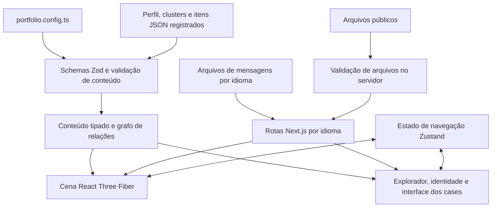

# Arquitetura

[English](../en/architecture.md) | [Português](./architecture.md) · [Voltar ao início](../../README.pt-BR.md)

Este guia é para quem quer contribuir com o motor. Para conteúdo pessoal, comece em [Monte seu portfólio](build-your-portfolio.md); a maior parte da personalização não exige mudanças em componentes.

## Visão geral do sistema

Vector Space é uma aplicação Next.js com rotas por idioma, interface HTML e uma cena Three.js executada no cliente. O conteúdo fica em arquivos JSON versionados junto com a aplicação. Não há painel de CMS, banco de dados ou API de conteúdo para configurar.

A camada de conteúdo valida os dados antes de chegarem à renderização. A cena e a interface HTML consomem as mesmas entidades, sinais e destinos do grafo, evitando um segundo modelo de conteúdo só para desenhar as conexões.

## Mapa do repositório

| Local | Responsabilidade |
|---|---|
| [`src/app/`](../../src/app/) | Páginas do App Router, layouts, estilos globais e metadados |
| [`src/i18n/`](../../src/i18n/) | Rotas por idioma, integração de requisições e carregamento de mensagens no servidor |
| [`src/content/`](../../src/content/) | Documentos JSON, mensagens de interface, registro e adaptadores tipados |
| [`src/lib/`](../../src/lib/) | Schemas, grafo, layout, regras de navegação, validação de arquivos e funções puras |
| [`src/store/experience-store.ts`](../../src/store/experience-store.ts) | Estado compartilhado de navegação e transições |
| [`src/components/portfolio/`](../../src/components/portfolio/) | Telas de entrada, HUD, contatos, explorador HTML e componentes de case |
| [`src/components/three/`](../../src/components/three/) | Canvas, câmera, clusters, nós, satélites e reconstrução de capas |
| [`public/assets/`](../../public/assets/) | Mídias públicas servidas diretamente pelo app |
| [`portfolio.config.ts`](../../portfolio.config.ts) | Configuração de idiomas e identidade do espaço |

## Carregamento e validação do conteúdo

1. [registry.ts](../../src/content/registry.ts) importa cada item e associa seus dados ao nome do arquivo de origem.
2. O [schema](../../src/lib/portfolio-schema.ts) valida formatos estritos, versão, campos traduzidos e destinos seguros. Validações da coleção rejeitam IDs/slugs duplicados, clusters desconhecidos e relações inválidas.
3. Adaptadores em `src/content/identity.ts`, `clusters.ts` e `nodes/index.ts` exportam conteúdo tipado.
4. [portfolio-graph.ts](../../src/lib/portfolio-graph.ts) resolve destinos compartilhados de identidade, clusters e nós, incluindo referências dos sinais.
5. [content-assets.server.ts](../../src/lib/content-assets.server.ts) valida arquivos locais referenciados em `/assets/` durante a geração das páginas e requisições de desenvolvimento. Verificações de filesystem ficam fora do bundle do cliente.

O registro explícito torna a inclusão revisável e mantém o cliente independente de descoberta pelo filesystem. Em troca, autores precisam adicionar um import e uma entrada no registro para cada arquivo. A string `file` fornece contexto útil aos erros; ela não carrega um documento sozinha.

## Navegação e renderização

[experience-store.ts](../../src/store/experience-store.ts) coordena `intro`, `language-selection`, `entering`, `overview`, `identity-focus`, `cluster-focus`, `node-focus` e `node-details`. Trocas de idioma preservam um estado de retomada. Cases abrem em um diálogo; slugs individuais ainda não criam rotas independentes para cada case.

[UniverseCanvas](../../src/components/three/UniverseCanvas.tsx) abriga a cena. [CameraRig](../../src/components/three/CameraRig.tsx) controla transições da câmera, com funções puras de navegação e interação em `src/lib/`. Malhas de clusters e nós renderizam conteúdo validado; o posicionamento automático é determinístico para uma mesma ordem de conteúdo e configuração. Coordenadas manuais permitem ajustar layouts quando necessário.

A cena desktop oferece órbita, deslocamento e zoom orientado pelo cursor. No celular, a navegação é guiada. Escape retorna pelos estados de detalhe, nó e cluster; `H` centraliza a visão geral. O explorador HTML de carreira oferece controles explícitos para alcançar o mesmo conteúdo. Uma interface alternativa continua disponível quando o WebGL não consegue iniciar.

Configurações de desempenho se adaptam ao dispositivo, à tela e às preferências de movimento. Elas limitam capas e satélites ativos e reduzem efeitos. [useProjectCoverTexture](../../src/components/three/useProjectCoverTexture.ts) gerencia carregamento de capas, visuais procedurais de fallback e um cache limitado de texturas. Um arquivo de conteúdo válido pode ter mais sinais do que um dispositivo exibe na órbita.

Ao alterar câmera ou seleção, preserve as regras verificadas pelas suítes de navegação, interação espacial, foco automático e estado. Confira teclado e tela estreita em um navegador real; um build bem-sucedido não comprova o funcionamento da interação espacial.

## Composição dos cases

[NodeDetailsPanel](../../src/components/portfolio/NodeDetailsPanel.tsx) fornece o diálogo, a restauração de foco e a capa/cabeçalho. [CaseEvidence](../../src/components/portfolio/CaseEvidence.tsx) renderiza metadados, sinais, conexões do grafo e evidências opcionais. [CaseContentRenderer](../../src/components/portfolio/CaseContentRenderer.tsx) mapeia os cinco tipos de blocos editoriais para o layout existente.

Autores controlam a ordem narrativa por `content`, enquanto o layout permanece em componentes e CSS. Enums pequenos permitem escolher alinhamento e largura das imagens sem aceitar estilos ou marcação arbitrários. Campos legados de evidência continuam suportados, o que facilita migrações, mas permite seções duplicadas se os dois modelos receberem o mesmo texto. Veja a [ordem de exibição](content-reference.md#ordem-de-exibição-do-case).

## Tradução e saída de produção

Traduções de conteúdo e mensagens da interface têm funções diferentes. [loadMessages](../../src/i18n/messages.ts) lê o catálogo padrão configurado e mescla traduções opcionais. O conteúdo traduzido usa o resolvedor de fallback para o idioma padrão. Destinos de currículo não têm fallback entre línguas de propósito.

[next.config.ts](../../next.config.ts) inclui explicitamente `src/content/messages/*.json` no rastreamento de arquivos da saída porque as mensagens são lidas dinamicamente pelo filesystem. Preserve essa inclusão ao mudar o empacotamento ou os caminhos das mensagens; veja o [rastreamento de saída do Next.js](https://nextjs.org/docs/app/api-reference/config/next-config-js/output). O projeto atual usa o fluxo normal de build/start de produção do Next.js, sem exportação estática.

## Trabalhando no motor

Rode `npm test`, `npm run typecheck` e `npm run build` para alterações relevantes no motor. Os testes compilam TypeScript em `.test-dist` e executam as suítes emitidas. O script de testes espera um shell compatível com POSIX. Não há comando de lint nem runner de testes de navegador incluído no projeto.

Alguns testes verificam intencionalmente os exemplos genéricos do template. Se alterar esses exemplos, atualize as expectativas junto com o conteúdo. Se mantiver um fork personalizado, diferencie mudanças de fixtures de regressões de comportamento, como explica o [tutorial](build-your-portfolio.md#sobre-os-testes-do-template).

Para um novo campo ou bloco, atualize juntos o schema, os tipos, o consumidor, os testes relevantes de validação/comportamento e as duas traduções da referência. Não adicione uma segunda fonte de textos de identidade ou carreira diretamente nos componentes.

Notas anteriores permanecem no [registro do refactor de conteúdo](../content-cms-refactor.md), em [plans](../plans/) e em [ideas](../ideas/). Elas fornecem contexto histórico; o código atual e estes guias descrevem o contrato suportado.

---

[Anterior: Referência de conteúdo](content-reference.md) · [Próximo: Solução de problemas](troubleshooting.md)
